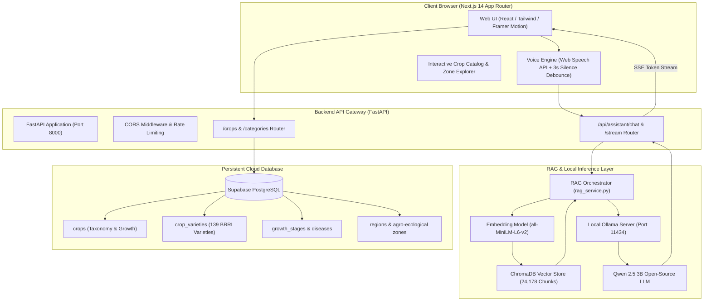
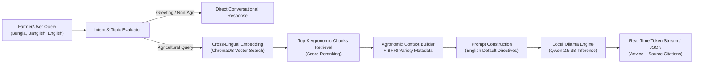
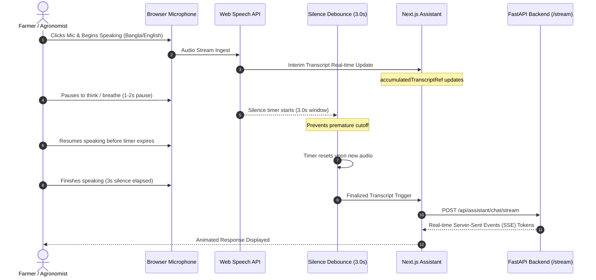
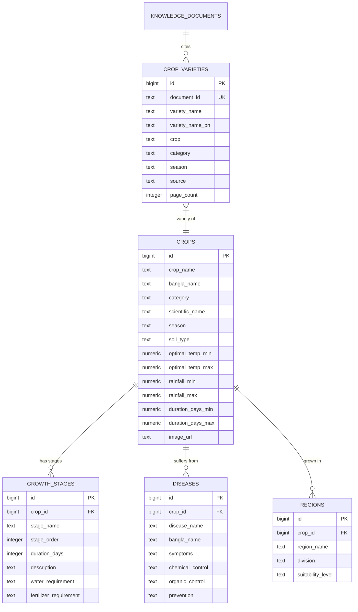

# 🌾 Bangladesh Crop Intelligence Assistant
### বাংলাদেশ কৃষি বুদ্ধিমত্তা সহকারী
> **A National-Scale AI Agronomic Decision Support Platform & Precision Agriculture Engine for Bangladesh**

[](https://nextjs.org/)
[](https://fastapi.tiangolo.com/)
[](https://www.python.org/)
[](https://www.typescriptlang.org/)
[-FF4F8B?style=for-the-badge)](https://www.trychroma.com/)
[](https://ollama.ai/)
[](https://supabase.com/)
[](https://tailwindcss.com/)

---

## 📌 Executive Overview

**Bangladesh Crop Intelligence Assistant** is an end-to-end, production-grade precision agriculture platform designed specifically for Bangladesh's agro-ecological diversity. It unites **high-resolution relational agronomy data** (covering 139 BRRI rice varieties and major national crops) with a **locally deployed cross-lingual Retrieval-Augmented Generation (RAG)** engine powered by **Qwen 2.5 (3B)** and **ChromaDB**.

The platform assists farmers, agricultural extension officers (DAE), researchers, and agri-entrepreneurs with real-time agronomic guidance, phenological schedules, pathology diagnosis, fertilizer recommendations, and climate resilience insights tailored across all **8 administrative divisions** and **30 Agro-Ecological Zones (AEZ)**.

---

## ✨ Key Platform Features

### 1. 🌾 Complete BRRI Rice & Crop Taxonomy
- **139 Official BRRI Rice Varieties**: Exhaustive profiles for Aus, Aman, and Boro seasons including life duration (days), average yield (t/ha), maximum yield, grain traits, and special attributes (salinity tolerance, submergence survival, zinc enrichment, drought resistance).
- **Core Agricultural Crops**: Detailed profiles for cereals, pulses, oilseeds, vegetables, spices, cash crops, and fiber crops.
- **Phenological Growth Stages**: Precise calendar-based breakdown from seedbed preparation to transplanting, tillering, panicle initiation, flowering, grain filling, and harvest.

### 2. 🧠 Cross-Lingual RAG Engine (Qwen 2.5 3B)
- **Multilingual Query Ingestion**: Understands queries typed or spoken in **Bangla (বাংলা)**, **Banglish (phonetic)**, and **English**.
- **Dense Vector Search**: Powered by **ChromaDB** containing **24,178 vectorized knowledge chunks** mined from BRRI, BARI, DAE, FAO, and BAMIS publications.
- **Default Structured English Responses**: Answers in crisp, English agronomic format by default for universal clarity, with automatic switching to Bangla whenever explicitly instructed (*"বাংলায় বলো"*).
- **Conversational Memory**: Maintains multi-turn dialog context (last 8 conversation turns) for natural follow-up questions.

### 3. 🎙️ Continuous Conversational Voice Input
- **Web Speech API Integration**: Seamless speech-to-text with bilingual speech detection (`bn-BD` / `en-US`).
- **3.0-Second Conversational Silence Debounce**: Prevents premature cutoff when users pause to think or breathe.
- **Socket Keep-Alive & Auto-Recovery**: Prevents Chromium socket disconnects with an asynchronous keep-alive restart mechanism.

### 4. 🗺️ Divisional Agro-Ecological Mapping
- Maps soil suitability, average precipitation, flooding susceptibility, and drought risk factors across all 8 divisions:
  - **Rangpur & Rajshahi**: Northern drought and cold-wave resilient cultivation.
  - **Sylhet & Mymensingh**: Flash-flood and Haor-adapted varieties (e.g., BRRI dhan29, BRRI dhan88).
  - **Khulna & Barisal**: Southern coastal salinity and tidal submergence varieties (e.g., BRRI dhan67, BRRI dhan73, BRRI dhan97).
  - **Dhaka & Chattogram**: High-yield central basin and hilly tract management.

### 5. 🩺 Pathology, Pest & Fertilizer Diagnostic Engine
- Diagnostic advisory for common agricultural pests and diseases (Blast, Bacterial Leaf Blight, Sheath Blight, Brown Planthopper, Stem Borer, Cutworm).
- Actionable treatment plans specifying active chemical ingredients, organic alternatives, and prevention protocols.

---

## 🏛️ System Architecture

The following diagram illustrates the complete flow of data between the frontend user interface, the FastAPI microservice gateway, the vector database, the local inference engine, and the Supabase cloud database:



---

## 🔄 Cross-Lingual RAG Pipeline Workflow

How natural language questions in Bangla or English are converted into precise agronomic advice:



---

## 🎙️ Continuous Voice Input Flow

The voice input pipeline features continuous audio recording, speech transcript accumulation, and a 3.0-second silence debounce timer:



---

## 🗄️ Relational Database Schema

The platform stores structured crop profiles and research documents in Supabase PostgreSQL:



---

## 📂 Project Directory Structure

```text
Bangladesh Crop Intelligence Assistant/
├── backend/                              # FastAPI Microservice
│   ├── data/                             # JSON databases & Supabase migration SQL
│   │   ├── bangladesh_crop_database_v2.json
│   │   └── supabase_knowledge_sync.sql   # SQL migration (139 varieties + tables)
│   ├── routes/                           # FastAPI Router endpoints
│   │   ├── crops.py                      # /crops, /categories, /search
│   │   └── assistant.py                  # /api/assistant/chat, /stream, /health
│   ├── services/                         # Core Business & AI Logic
│   │   ├── llm_client.py                 # Ollama Qwen 2.5 client with retry & stream
│   │   ├── rag_service.py                # Cross-lingual RAG retrieval & prompt engine
│   │   ├── supabase_client.py            # Supabase database connection pool
│   │   └── weather_service.py            # Real-time agro-meteorological service
│   ├── .env.example                      # Backend environment variable template
│   ├── main.py                           # FastAPI application entrypoint
│   └── requirements.txt                  # Backend Python dependencies
│
├── frontend/                             # Next.js 14 Frontend Platform
│   ├── public/                           # Static assets (logo.png, icons)
│   ├── src/
│   │   ├── app/                          # Next.js App Router Pages
│   │   │   ├── layout.tsx                # Global Root Layout & Favicon
│   │   │   ├── page.tsx                  # Homepage Hero & Feature Showcase
│   │   │   ├── assistant/page.tsx        # AI Assistant Chat & Voice Interface
│   │   │   ├── crops/page.tsx            # All Crops Catalog & Search
│   │   │   ├── crops/[name]/page.tsx     # Dynamic Individual Crop Profile
│   │   │   └── login/page.tsx            # Protected Personnel Access
│   │   ├── components/                   # Reusable UI Components
│   │   │   ├── Navbar.tsx                # Navigation bar with dynamic telemetry
│   │   │   └── Footer.tsx                # Informational footer & AEZ division tags
│   │   ├── context/                      # State Management (AuthContext)
│   │   └── lib/                          # Utility & API Client bindings
│   ├── .env.example                      # Frontend environment variable template
│   ├── package.json                      # Node.js dependencies
│   └── tailwind.config.ts                # Custom Tailwind design tokens
│
├── knowledge_base/                       # Curated Agronomic Corpus
│   ├── chunks/chunks.json                # Pre-processed chunks with citations
│   ├── processed/                        # Cleaned text corpus from research papers
│   └── metadata/                         # Document manifests & indexing hashes
│
├── vector_store/                         # ChromaDB Vector Store Tools
│   ├── embedding_service.py              # Sentence transformer embedding pipeline
│   ├── indexer.py                        # Batch chunk vectorization script
│   └── main.py                           # CLI for indexing knowledge_base
│
├── document_processor/                   # PDF & Document Extraction Pipeline
│   ├── extractor.py                      # Text & table extraction from BRRI PDFs
│   ├── chunker.py                        # Context-aware semantic text chunking
│   └── cleaner.py                        # Banglish/Bangla Unicode normalizer
│
├── .env.example                          # Root environment template
├── .gitignore                            # Production git ignore (secrets, venvs, DBs)
├── README.md                             # Comprehensive Platform Documentation
└── requirements.txt                      # Complete Root Python dependencies
```

---

## 🚀 Step-by-Step Installation & Setup

### Prerequisites
- **Python**: `3.10` or higher (`3.11` recommended)
- **Node.js**: `18.17.0` or higher (`v20.x LTS` recommended)
- **Ollama**: Installed from [ollama.ai](https://ollama.ai/)
- **Git**: Installed and configured

---

### Step 1: Clone the Repository
```bash
git clone https://github.com/your-username/bangladesh-crop-intelligence.git
cd bangladesh-crop-intelligence
```

---

### Step 2: Configure and Start the Local LLM (Ollama)
The assistant uses the high-efficiency **Qwen 2.5 (3B)** model, ideal for fast inference:
```bash
# Pull the 3B parameter model (~2.0 GB)
ollama pull qwen2.5:3b

# Start Ollama service (defaults to http://localhost:11434)
ollama serve
```

---

### Step 3: Backend Setup (FastAPI)
1. Navigate to the backend directory and set up a virtual environment:
   ```bash
   cd backend
   python -m venv .venv
   ```

2. Activate the virtual environment:
   - **Windows (PowerShell)**:
     ```powershell
     .\.venv\Scripts\Activate.ps1
     ```
   - **Linux / macOS**:
     ```bash
     source .venv/bin/activate
     ```

3. Install required packages:
   ```bash
   pip install -r requirements.txt
   ```

4. Configure your `.env` file:
   ```bash
   cp .env.example .env
   ```
   Open `backend/.env` and insert your Supabase credentials:
   ```env
   SUPABASE_URL=https://your-project-id.supabase.co
   SUPABASE_KEY=your_supabase_anon_key
   OLLAMA_BASE_URL=http://localhost:11434
   LLM_MODEL=qwen2.5:3b
   OLLAMA_TIMEOUT=120.0
   CORS_ORIGINS=http://localhost:3000,http://127.0.0.1:3000
   ```

5. Launch the FastAPI server:
   ```bash
   python -m uvicorn main:app --host 127.0.0.1 --port 8000 --reload
   ```
   *The backend will be available at `http://127.0.0.1:8000` (API docs at `http://127.0.0.1:8000/docs`).*

---

### Step 4: Database Setup (Supabase)
1. Go to your [Supabase Dashboard](https://supabase.com/dashboard) and open the **SQL Editor**.
2. Open [`backend/data/supabase_knowledge_sync.sql`](backend/data/supabase_knowledge_sync.sql), copy its contents, and execute the query.
3. This creates all relational tables (`crops`, `growth_stages`, `diseases`, `regions`, `crop_varieties`, `knowledge_documents`) and populates all **139 BRRI rice varieties**.

---

### Step 5: Frontend Setup (Next.js)
1. Open a new terminal and navigate to the frontend directory:
   ```bash
   cd frontend
   ```

2. Install Node dependencies:
   ```bash
   npm install
   ```

3. Configure your `.env.local` file:
   ```bash
   cp .env.example .env.local
   ```
   Configure `frontend/.env.local`:
   ```env
   NEXT_PUBLIC_API_URL=http://127.0.0.1:8000
   NEXT_PUBLIC_SUPABASE_URL=https://your-project-id.supabase.co
   NEXT_PUBLIC_SUPABASE_ANON_KEY=your_supabase_anon_key
   ```

4. Launch the frontend development server:
   ```bash
   npm run dev
   ```
   *Open [http://localhost:3000](http://localhost:3000) in your browser.*

---

## 📡 API Reference

### Health & Telemetry
| Method | Endpoint | Description |
| :--- | :--- | :--- |
| `GET` | `/` | Root API status and service metadata |
| `GET` | `/api/assistant/health` | LLM connectivity, model name, and vector count |

### Crop Intelligence & Taxonomy
| Method | Endpoint | Description |
| :--- | :--- | :--- |
| `GET` | `/crops` | List all 25 crops with seasonal and divisional filters |
| `GET` | `/crops/{crop_name}` | Detailed crop record with growth stages and diseases |
| `GET` | `/categories/{category}` | Filter crops by category (cereals, pulses, etc.) |
| `GET` | `/search?query={query}` | Search crops by Bangla or English name |

### AI Assistant & RAG
| Method | Endpoint | Description |
| :--- | :--- | :--- |
| `POST` | `/api/assistant/chat` | Standard JSON response for single-turn or multi-turn queries |
| `POST` | `/api/assistant/chat/stream` | Server-Sent Events (SSE) streaming token output |

#### Sample Request (`POST /api/assistant/chat`):
```json
{
  "message": "বোরো মৌসুমে কোন ধানের জাত ভালো?",
  "history": []
}
```

#### Sample Response:
```json
{
  "reply": "For the Boro season in Bangladesh, high-yielding and resilient BRRI rice varieties include:\n\n1. BRRI dhan28: Early maturing (140 days) with high yield potential (5.0-6.0 t/ha).\n2. BRRI dhan29: High yielding (7.5 t/ha) standard for irrigated conditions.\n3. BRRI dhan88: Premium grain quality and lodging resistance.\n4. BRRI dhan89: High yielding (8.0 t/ha) replacement for BRRI dhan29.\n\nFor saline coastal belts, BRRI dhan67 and BRRI dhan97 are highly recommended.",
  "sources": [
    {
      "title": "BRRI Rice Knowledge Bank - Boro Varieties",
      "category": "cereals",
      "source": "BRRI"
    }
  ]
}
```

---

## 🛡️ Production & Security Checklist

Before deploying this platform to public cloud environments (e.g., Vercel + AWS/Fly.io/Render):
1. **Never commit `.env` or `.env.local`**: Ensure private keys, Supabase Service Role keys, and database passwords are only injected via cloud environment variable secrets.
2. **Restrict CORS**: In `backend/main.py` and `backend/.env`, set `CORS_ORIGINS` to your production frontend domain (e.g. `https://cropintel-bd.com`).
3. **ChromaDB Persistence**: In containerized environments, mount a persistent Docker volume for `knowledge_base/chroma_db/` or connect to a managed vector service.
4. **Ollama Deployment**: Host Ollama on a GPU-enabled VM (e.g., RunPod, AWS EC2 g4dn) and point `OLLAMA_BASE_URL` to your private microservice URL.

---

## 📚 Acknowledgements & Data Sources

This platform builds upon scientific research and open agronomic data provided by:
- **Bangladesh Rice Research Institute (BRRI)** — Rice variety data, duration, yield, and pathology guidelines.
- **Department of Agricultural Extension (DAE)** — Fertilizer schedules and regional agro-ecological advisories.
- **Bangladesh Agricultural Research Institute (BARI)** — Cash crops, pulses, and oilseeds data.
- **Bangladesh Agro-Meteorological Information System (BAMIS)** — Agro-climatic risk zoning.
- **Food and Agriculture Organization (FAO)** — Soil suitability and crop calendar standards.

---

## 📄 License
This project is open-source under the [MIT License](LICENSE).
