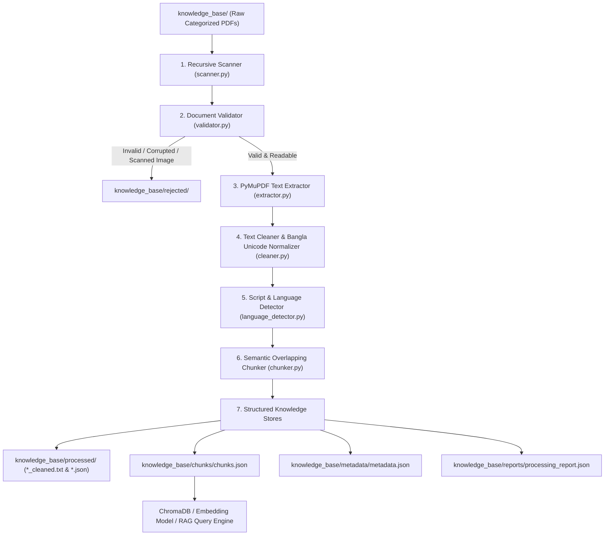

# Document Processing & RAG Preparation Pipeline

Part of the **Bangladesh Crop Intelligence Assistant**.

This module transforms raw agricultural PDF documents collected across trusted government institutions (BRRI, BARI, DAE, BAMIS, BARC, FAO) into validated, cleaned, and page-attributed semantic chunks ready for vector embedding generation, ChromaDB ingestion, and high-accuracy RAG (Retrieval-Augmented Generation).

---

## 1. Architecture



---

## 2. Directory Structure

```text
Bangladesh Crop Intelligence Assistant/
│
├── document_processor/            # STANDALONE PROCESSING MODULE
│   ├── __init__.py
│   ├── config.py                  # Chunk sizes, overlap, thresholds, paths
│   ├── requirements.txt           # pymupdf, pydantic, rich
│   ├── scanner.py                 # Recursive scanner for categorized PDFs
│   ├── validator.py               # Magic bytes, PDF integrity & corrupt text detection
│   ├── extractor.py               # PyMuPDF fast per-page text extractor
│   ├── cleaner.py                 # Bangla NFKC normalizer, header/footer/page number stripper
│   ├── language_detector.py       # Bengali (\u0980-\u09FF) vs English script detector
│   ├── chunker.py                 # Sentence/paragraph recursive chunker with metadata
│   ├── pipeline.py                # Pipeline orchestrator & JSON report generator
│   ├── main.py                    # CLI entrypoint
│   └── README.md                  # This documentation
│
└── knowledge_base/
    ├── cereals/                   # Raw PDFs by category
    ├── fruits/
    ├── vegetables/
    ├── ...
    ├── processed/                 # Cleaned full texts & per-doc JSON
    ├── chunks/
    │   └── chunks.json            # Final ChromaDB-ready chunks with full metadata
    ├── metadata/
    │   └── metadata.json          # Master document-level index
    ├── reports/
    │   └── processing_report.json # Detailed processing metrics & rejection logs
    └── rejected/                  # Files moved due to corruption/scanned status
```

---

## 3. Workflow & Processing Stages

1. **Recursive Scan**: Traverses all agricultural category folders in `knowledge_base/`, resolving categories and original source agency from companion JSON or filename prefixes.
2. **Document Validation**:
   - Verifies `%PDF-` header magic bytes.
   - Tests opening with PyMuPDF.
   - Checks password protection.
   - Enforces minimum extractable character threshold ($\ge 100$ characters) to reject bitmap scans that lack text layers.
   - Calculates gibberish/corrupted font ratio.
   - Automatically relocates invalid documents to `knowledge_base/rejected/{category}/`.
3. **PyMuPDF Extraction**: Extracts text with page-level tracking (1-indexed).
4. **Text Cleaning & Normalization**:
   - Standardizes Bengali glyphs using **Unicode NFKC**.
   - Removes zero-width markers (`\u200B`, `\u200C`, `\u200D`, `\uFEFF`) and control codes.
   - Scans across all pages to detect and eliminate repeated running headers and footers.
   - Strips English and Bengali page numbers (`Page 1`, `১২`, `পৃষ্ঠা ৩`).
   - Normalizes whitespace and fixes hyphenated line wraps.
5. **Language Detection**: Classifies text as `Bangla`, `English`, or `Bilingual`.
6. **Semantic Chunking**:
   - Splits by paragraphs and sentences (Bengali dāri `।` and English terminal punctuation).
   - Generates chunks of `chunk_size` characters with `chunk_overlap`.
   - Preserves exact source `page_number` for each chunk.

---

## 4. Chunk Metadata Schema (`chunks.json`)

Each chunk strictly conforms to the requested specification:

```json
{
  "text": "বোরো মৌসুমে ব্রি ধান২৮ ও ব্রি ধান২৯ চাষের জন্য বীজতলা তৈরির উপযুক্ত সময় হলো...",
  "source": "BRRI",
  "category": "cereals",
  "page_number": 4,
  "language": "Bangla",
  "chunk_id": "brri_journal_16_2012_p4_c012",
  "document_id": "brri_journal_16_2012",
  "chunk_index": 12,
  "char_count": 682
}
```

---

## 5. ChromaDB & RAG Compatibility

Load the generated `chunks.json` directly into ChromaDB:

```python
import json
import chromadb

# Initialize ChromaDB client
client = chromadb.PersistentClient(path="./chroma_db")
collection = client.get_or_create_collection(name="bangladesh_crops")

# Load generated chunks
with open("knowledge_base/chunks/chunks.json", "r", encoding="utf-8") as f:
    chunks = json.load(f)

# Batch add directly
collection.add(
    ids=[c["chunk_id"] for c in chunks],
    documents=[c["text"] for c in chunks],
    metadatas=[{
        "source": c["source"],
        "category": c["category"],
        "page_number": c["page_number"],
        "language": c["language"],
        "document_id": c["document_id"]
    } for c in chunks]
)
```

---

## 6. CLI Usage

Run the pipeline from the project root:

```powershell
# 1. Run full document processing with default settings (800 chars, 150 overlap)
..\crawler\.venv\Scripts\python.exe -m document_processor.main

# 2. Customize chunk size and overlap
..\crawler\.venv\Scripts\python.exe -m document_processor.main --chunk-size 1000 --chunk-overlap 200

# 3. Dry-run simulation (prints what will happen without writing files)
..\crawler\.venv\Scripts\python.exe -m document_processor.main --dry-run

# 4. View processing metrics and rejection report
..\crawler\.venv\Scripts\python.exe -m document_processor.main --stats
```
